# BadLabels
The code repository for a challenging label noise called ***BadLabels*** and a robust label-noise learning (LNL) algorithm called ***Robust DivideMix***.

## Prerequisites
Python (3.8)  
Pytorch (1.8.0)  
CUDA  
Numpy  

## Usage
### Part 1: Generate BadLabels
You can run the following command to synthesize BadLabels.
```
cd gen_badlabels
./gen_badlabels.sh
```

### Part 2: Evaluate BadLabels
Run the following command to evaluate BadLabels on various LNL algorithms.
```
cd eval_badlabels
./eval_badlabels.sh
```

We have shared various label noises generated by us under the ***eval_badlabels/noise*** directory for quick experimental verification.

If you want to quickly evaluate BadLabels on your own algorithm, we also provide MNIST, CIFAR-10 and CIFAR-100 training sets with injected BadLabels in [Google Drive](https://drive.google.com/drive/folders/1ZGA2_KzYK8KCl89Zko4ahjnAk6s9K3pX?usp=sharing). You can easily load the datasets using ***load_badlabels_dataset.py*** under the ***eval_badlabels*** directory.

#### *Evaluation results on CIFAR-10, CIFAR-100 and MNIST*
Here we share our evaluation results on CIFAR-10, CIFAR-100, and MNIST. 

We evaluated using Standard Training (no defense) [[paper](https://arxiv.org/pdf/1706.05394.pdf)] and 10 state-of-the-art LNL methods as baselines. 
Specifically, these methods are as follows: Co-teaching [[paper](https://arxiv.org/pdf/1804.06872.pdf), [code](https://github.com/bhanML/Co-teaching)], 
T-Revision [[paper](https://papers.nips.cc/paper_files/paper/2019/file/9308b0d6e5898366a4a986bc33f3d3e7-Paper.pdf), [code](https://github.com/xiaoboxia/T-Revision)], 
RoG [[paper](https://arxiv.org/pdf/1901.11300.pdf), [code](https://github.com/pokaxpoka/RoGNoisyLabel)], 
DivideMix [[paper](https://openreview.net/pdf?id=HJgExaVtwr), [code](https://github.com/LiJunnan1992/DivideMix)], 
AdaCorr [[paper](https://arxiv.org/pdf/2011.10077.pdf), [code](https://github.com/pingqingsheng/LRT)], 
Peer Loss [[paper](https://arxiv.org/pdf/1910.03231.pdf), [code](https://github.com/weijiaheng/Multi-class-Peer-Loss-functions)], 
Negative LS [[paper](https://arxiv.org/pdf/2106.04149.pdf), [code](https://github.com/UCSC-REAL/negative-label-smoothing)], 
PGDF [[paper](https://arxiv.org/pdf/2112.01197.pdf), [code](https://github.com/bupt-ai-cz/PGDF)], 
ProMix [[paper](https://arxiv.org/pdf/2207.10276.pdf), [code](https://github.com/Justherozen/ProMix)], 
SOP [[paper](https://proceedings.mlr.press/v162/liu22w/liu22w.pdf), [code](https://github.com/shengliu66/SOP)].

<table style="font-size: 12px;">
    <caption style="font-size: 16px;">Test accuracy (%) on CIFAR-10 with different noise types and noise ratios. The most robust evaluations for each LNL method are highlighted in bold.</caption>
	<tr>
        <th colspan="2" rowspan="3">Method</th>
	    <th colspan="14">Noise type / Noise ratio</th>
	</tr >
    <tr>
        <th colspan="4">Sym.</th>
        <th colspan="2">Asym.</th>
        <th colspan="4">IDN</th>
        <th colspan="4">BadLabels</th>
    </tr>
    <tr align="center">
        <td>20%</td><td>40%</td><td>60%</td><td>80%</td><td>20%</td><td>40%</td><td>20%</td><td>40%</td><td>60%</td><td>80%</td><td>20%</td><td>40%</td><td>60%</td><td>80%</td>
    </tr>
    <tr align="center">
        <th rowspan="2"><a href="https://arxiv.org/pdf/1706.05394.pdf">Standard Training</a></th>
        <td>Best</td>
		<td>85.21</td><td>79.90</td><td>69.79</td><td>43.00</td><td>88.02</td><td>85.22</td><td>85.42</td><td>78.93</td><td>68.97</td><td>55.34</td><th>76.76±1.08</th><th>58.79±1.49</th><th>39.64±1.13</th><th>17.80±0.91</th>    </tr>
    <tr align="center">
        <td>Last</td>
		<td>82.55</td><td>64.79</td><td>41.43</td><td>17.20</td><td>87.28</td><td>77.04</td><td>85.23</td><td>74.06</td><td>52.22</td><td>28.04</td><th>75.31±0.24</th><th>55.72±0.17</th><th>35.66±0.23</th><th>13.44±0.26</th>    </tr>
    <tr align="center">
        <th rowspan="2"><a href="https://arxiv.org/pdf/1804.06872.pdf">Co-teaching</a></th>
        <td>Best</td>
		<td>89.19</td><td>84.80</td><td>58.25</td><td>21.76</td><td>90.65</td><td>63.11</td><td>85.72</td><td>73.42</td><td>45.84</td><td>33.43</td><th>80.41±0.78</th><th>56.81±3.86</th><th>14.42±1.22</th><th>10.51±0.71</th>    </tr>
    <tr align="center">
        <td>Last</td>
		<td>89.03</td><td>84.65</td><td>57.95</td><td>21.06</td><td>90.52</td><td>56.33</td><td>85.48</td><td>72.97</td><td>45.53</td><td>25.27</td><th>79.48±0.75</th><th>55.54±3.74</th><th>12.99±1.09</th><th>4.24±2.44</th>    </tr>
    <tr align="center">
        <th rowspan="2"><a href="https://papers.nips.cc/paper_files/paper/2019/file/9308b0d6e5898366a4a986bc33f3d3e7-Paper.pdf">T-Revision</a></th>
        <td>Best</td>
		<td>89.79</td><td>86.83</td><td>78.14</td><td>64.54</td><td>91.23</td><td>89.60</td><td>85.74</td><td>78.45</td><td>69.31</td><td>56.26</td><th>76.99±1.38</th><th>57.21±1.64</th><th>36.01±1.10</th><th>14.93±0.50</th>    </tr>
    <tr align="center">
        <td>Last</td>
		<td>89.59</td><td>86.57</td><td>76.85</td><td>60.54</td><td>91.09</td><td>89.40</td><td>85.43</td><td>69.18</td><td>58.15</td><td>33.15</td><th>75.71±1.68</th><th>55.02±1.34</th><th>33.99±0.29</th><th>13.16±0.68</th>    </tr>
    <tr align="center">
        <th rowspan="2"><a href="https://arxiv.org/pdf/1901.11300.pdf">RoG</a></th>
        <td>Best</td>
		<td>-</td><td>-</td><td>-</td><td>-</td><td>-</td><td>-</td><td>-</td><td>-</td><td>-</td><td>-</td><td>-</td><td>-</td><td>-</td><td>-</td>    </tr>
    <tr align="center">
        <td>Last</td>
		<td>87.48</td><td>74.81</td><td>52.42</td><td>16.02</td><td>89.61</td><td>81.63</td><th>85.34</th><td>76.68</td><td>63.79</td><td>37.11</td><td>85.88±0.32</td><th>64.20±0.91</th><th>35.89±1.34</th><th>8.64±0.76</th>    </tr>
    <tr align="center">
        <th rowspan="2"><a href="https://openreview.net/pdf?id=HJgExaVtwr">DivideMix</a></th>
        <td>Best</td>
		<td>96.21</td><td>95.08</td><td>94.80</td><td>81.95</td><td>94.82</td><td>94.20</td><td>91.97</td><td>85.84</td><td>81.59</td><td>59.06</td><th>84.81±0.78</th><th>58.44±1.45</th><th>28.38±0.56</th><th>6.87±0.59</th>    </tr>
    <tr align="center">
        <td>Last</td>
		<td>96.04</td><td>94.74</td><td>94.56</td><td>81.58</td><td>94.46</td><td>93.50</td><td>90.77</td><td>82.94</td><td>81.19</td><td>47.81</td><th>82.13±0.78</th><th>57.65±1.96</th><th>16.21±1.24</th><th>6.12±0.45</th>    </tr>
    <tr align="center">
        <th rowspan="2"><a href="https://arxiv.org/pdf/2011.10077.pdf">AdaCorr</a></th>
        <td>Best</td>
		<td>90.66</td><td>87.17</td><td>80.97</td><td>35.97</td><td>92.35</td><td>88.60</td><td>85.88</td><td>79.54</td><td>69.36</td><td>55.86</td><th>76.97±0.83</th><th>57.17±0.71</th><th>37.14±0.38</th><th>14.72±0.86</th>    </tr>
    <tr align="center">
        <td>Last</td>
		<td>90.46</td><td>86.78</td><td>80.66</td><td>35.67</td><td>92.17</td><td>88.34</td><td>85.70</td><td>79.05</td><td>59.13</td><td>30.48</td><th>74.71±0.26</th><th>54.92±0.22</th><th>34.71±0.22</th><th>11.94±0.12</th>    </tr>
    <tr align="center">
        <th rowspan="2"><a href="https://arxiv.org/pdf/1910.03231.pdf">Peer Loss</a></th>
        <td>Best</td>
		<td>90.87</td><td>87.13</td><td>79.03</td><td>61.91</td><td>91.47</td><td>87.50</td><td>86.46</td><td>81.07</td><td>69.87</td><td>55.51</td><th>75.28±1.43</th><th>55.75±1.39</th><th>36.17±0.23</th><th>15.87±0.30</th>    </tr>
    <tr align="center">
        <td>Last</td>
		<td>90.65</td><td>86.85</td><td>78.83</td><td>61.43</td><td>91.11</td><td>81.24</td><td>85.72</td><td>74.43</td><td>54.57</td><td>33.76</td><th>74.00±1.43</th><th>53.73±1.25</th><th>34.37±0.68</th><th>14.71±0.22</th>    </tr>
    <tr align="center">
        <th rowspan="2"><a href="https://arxiv.org/pdf/2106.04149.pdf">Negative LS</a></th>
        <td>Best</td>
		<td>87.42</td><td>84.40</td><td>75.22</td><td>43.62</td><td>88.34</td><td>85.03</td><td>89.82</td><td>83.66</td><td>75.76</td><td>64.21</td><th>78.77±0.66</th><th>57.68±0.89</th><th>36.57±0.88</th><th>16.46±0.82</th>    </tr>
    <tr align="center">
        <td>Last</td>
		<td>87.30</td><td>84.21</td><td>75.07</td><td>43.50</td><th>65.23</th><th>47.22</th><td>81.87</td><td>82.10</td><td>70.95</td><td>45.62</td><td>73.99±0.90</td><td>52.45±1.03</td><th>26.66±0.81</th><th>3.21±0.44</th>    </tr>
    <tr align="center">
        <th rowspan="2"><a href="https://arxiv.org/pdf/2112.01197.pdf">PGDF</a></th>
        <td>Best</td>
		<td>96.63</td><td>96.12</td><td>95.05</td><td>80.69</td><td>96.05</td><td>89.87</td><td>91.81</td><td>85.75</td><td>76.84</td><td>59.60</td><th>82.72±0.47</th><th>61.50±1.87</th><th>34.46±1.44</th><th>6.37±0.34</th>    </tr>
    <tr align="center">
        <td>Last</td>
		<td>96.40</td><td>95.95</td><td>94.75</td><td>79.76</td><td>95.74</td><td>88.45</td><td>91.30</td><td>84.31</td><td>69.54</td><td>34.81</td><th>79.95±0.36</th><th>56.26±1.03</th><th>30.14±0.85</th><th>4.56±0.45</th>    </tr>
    <tr align="center">
        <th rowspan="2"><a href="https://arxiv.org/pdf/2207.10276.pdf">ProMix</a></th>
        <td>Best</td>
		<td>97.40</td><td>96.98</td><td>90.80</td><td>61.15</td><td>97.04</td><td>96.09</td><td>94.72</td><td>91.32</td><td>76.22</td><td>54.01</td><th>94.95±1.43</th><th>48.36±1.72</th><th>24.87±1.47</th><th>9.51±1.51</th>    </tr>
    <tr align="center">
        <td>Last</td>
		<td>97.30</td><td>96.91</td><td>90.72</td><td>52.25</td><td>96.94</td><td>96.03</td><td>94.63</td><td>91.01</td><td>75.12</td><td>45.80</td><th>94.59±1.64</th><th>44.08±0.49</th><th>21.33±0.46</th><th>7.93±1.34</th>    </tr>
    <tr align="center">
        <th rowspan="2"><a href="https://proceedings.mlr.press/v162/liu22w/liu22w.pdf">SOP</a></th>
        <td>Best</td>
		<td>96.17</td><td>95.64</td><td>94.83</td><td>89.94</td><td>95.96</td><td>93.60</td><td>90.32</td><td>83.26</td><td>71.54</td><td>57.14</td><th>84.96±0.35</th><th>66.25±1.35</th><th>42.59±1.25</th><th>12.70±0.89</th>    </tr>
    <tr align="center">
        <td>Last</td>
		<td>96.12</td><td>95.46</td><td>94.71</td><td>89.78</td><td>95.86</td><td>93.30</td><td>90.13</td><td>82.91</td><td>63.14</td><td>29.86</td><th>82.64±0.27</th><th>61.89±0.25</th><th>36.51±0.26</th><th>8.63±0.17</th>    </tr>
</table>

<table style="font-size: 12px;">
    <caption style="font-size: 16px;">Test accuracy (%) on CIFAR-100 with different noise types and noise ratios.</caption>
	<tr>
        <th colspan="2" rowspan="3">Method</th>
	    <th colspan="12">Noise type / Noise ratio</th>
	</tr >
    <tr>
        <th colspan="4">Sym.</th>
        <th colspan="4">IDN</th>
        <th colspan="4">BadLabels</th>
    </tr>
    <tr align="center">
        <td>20%</td><td>40%</td><td>60%</td><td>80%</td><td>20%</td><td>40%</td><td>60%</td><td>80%</td><td>20%</td><td>40%</td><td>60%</td><td>80%</td>
    </tr>
    <tr align="center">
        <th rowspan="2"><a href="https://arxiv.org/pdf/1706.05394.pdf">Standard Training</a></th>
        <td>Best</td>
		<td>61.41</td><td>51.21</td><td>38.82</td><td>19.89</td><td>70.06</td><td>62.48</td><td>53.21</td><td>45.77</td><th>56.75±0.98</th><th>35.42±0.77</th><th>17.70±1.02</th><th>6.03±0.24</th>    </tr>
    <tr align="center">
        <td>Last</td>
		<td>61.17</td><td>46.27</td><td>27.01</td><td>9.27</td><td>69.94</td><td>62.32</td><td>52.55</td><td>40.45</td><th>56.30±0.13</th><th>34.90±0.17</th><th>17.05±0.28</th><th>4.18±0.16</th>    </tr>
    <tr align="center">
        <th rowspan="2"><a href="https://arxiv.org/pdf/1804.06872.pdf">Co-teaching</a></th>
        <td>Best</td>
		<td>62.80</td><td>55.02</td><td>34.66</td><td>7.72</td><td>66.16</td><td>57.55</td><td>45.38</td><td>23.83</td><th>54.30±0.78</th><th>26.02±2.13</th><th>3.97±0.11</th><th>0.99±0.21</th>    </tr>
    <tr align="center">
        <td>Last</td>
		<td>62.35</td><td>54.84</td><td>33.44</td><td>6.78</td><td>66.02</td><td>57.33</td><td>45.24</td><td>23.72</td><th>53.97±0.71</th><th>25.74±1.21</th><th>3.67±0.14</th><th>0.00±0.00</th>    </tr>
    <tr align="center">
        <th rowspan="2"><a href="https://papers.nips.cc/paper_files/paper/2019/file/9308b0d6e5898366a4a986bc33f3d3e7-Paper.pdf">T-Revision</a></th>
        <td>Best</td>
		<td>65.19</td><td>60.43</td><td>43.01</td><td>4.03</td><td>68.77</td><td>62.86</td><td>54.23</td><td>45.67</td><th>57.86±1.02</th><th>40.60±1.33</th><th>13.06±1.20</th><th>1.92±0.56</th>    </tr>
    <tr align="center">
        <td>Last</td>
		<td>64.95</td><td>60.26</td><td>42.77</td><td>3.12</td><td>68.53</td><td>62.39</td><td>53.07</td><td>41.85</td><th>57.26±1.54</th><th>38.40±0.96</th><th>12.65±0.58</th><th>1.43±0.95</th>    </tr>
    <tr align="center">
        <th rowspan="2"><a href="https://arxiv.org/pdf/1901.11300.pdf">RoG</a></th>
        <td>Best</td>
		<td>-</td><td>-</td><td>-</td><td>-</td><td>-</td><td>-</td><td>-</td><td>-</td><td>-</td><td>-</td><td>-</td><td>-</td>    </tr>
    <tr align="center">
        <td>Last</td>
		<td>66.68</td><td>60.79</td><td>53.08</td><td>22.73</td><th>66.39</th><td>60.80</td><td>56.00</td><td>48.62</td><td>70.55±0.55</td><th>58.61±0.65</th><th>25.74±0.28</th><th>4.13±0.41</th>    </tr>
    <tr align="center">
        <th rowspan="2"><a href="https://openreview.net/pdf?id=HJgExaVtwr">DivideMix</a></th>
        <td>Best</td>
		<td>77.36</td><td>75.02</td><td>72.25</td><td>57.56</td><td>72.79</td><td>67.82</td><td>61.08</td><td>51.50</td><th>65.55±0.65</th><th>42.72±0.44</th><th>19.17±1.28</th><th>4.67±0.87</th>    </tr>
    <tr align="center">
        <td>Last</td>
		<td>76.87</td><td>74.66</td><td>71.91</td><td>57.08</td><td>72.50</td><td>67.37</td><td>60.55</td><td>47.86</td><th>64.96±0.47</th><th>40.92±0.36</th><th>13.04±0.85</th><th>1.10±0.21</th>    </tr>
    <tr align="center">
        <th rowspan="2"><a href="https://arxiv.org/pdf/2011.10077.pdf">AdaCorr</a></th>
        <td>Best</td>
		<td>66.31</td><td>59.78</td><td>47.22</td><td>24.15</td><td>68.89</td><td>62.63</td><td>54.91</td><td>45.22</td><th>56.22±0.82</th><th>35.38±1.27</th><th>16.87±1.36</th><th>4.81±0.22</th>    </tr>
    <tr align="center">
        <td>Last</td>
		<td>66.03</td><td>59.48</td><td>47.04</td><td>23.90</td><td>68.72</td><td>62.45</td><td>54.68</td><td>41.95</td><th>55.69±0.44</th><th>33.88±0.88</th><th>14.88±0.52</th><th>3.76±1.24</th>    </tr>
    <tr align="center">
        <th rowspan="2"><a href="https://arxiv.org/pdf/1910.03231.pdf">Peer Loss</a></th>
        <td>Best</td>
		<td>61.97</td><td>51.09</td><td>39.98</td><td>18.82</td><td>69.63</td><td>63.32</td><td>55.01</td><td>46.20</td><th>55.58±1.79</th><th>37.11±2.01</th><th>19.53±1.29</th><th>6.42±0.52</th>    </tr>
    <tr align="center">
        <td>Last</td>
		<td>60.64</td><td>43.64</td><td>26.23</td><td>7.65</td><td>69.38</td><td>62.70</td><td>53.90</td><td>42.14</td><th>55.00±1.41</th><th>35.85±1.48</th><th>18.65±0.22</th><th>5.74±0.76</th>    </tr>
    <tr align="center">
        <th rowspan="2"><a href="https://arxiv.org/pdf/2106.04149.pdf">Negative LS</a></th>
        <td>Best</td>
		<td>63.65</td><td>57.17</td><td>44.18</td><td>21.31</td><td>69.20</td><td>62.67</td><td>54.49</td><td>46.96</td><th>57.76±0.56</th><th>36.80±0.21</th><th>17.96±0.31</th><th>5.88±0.11</th>    </tr>
    <tr align="center">
        <td>Last</td>
		<td>63.54</td><td>56.98</td><td>43.98</td><td>21.19</td><td>63.38</td><td>55.72</td><td>42.87</td><td>24.69</td><th>56.42±0.71</th><th>33.38±0.22</th><th>11.42±0.38</th><th>1.28±0.14</th>    </tr>
    <tr align="center">
        <th rowspan="2"><a href="https://arxiv.org/pdf/2112.01197.pdf">PGDF</a></th>
        <td>Best</td>
		<td>81.90</td><td>78.50</td><td>74.05</td><td>52.48</td><td>75.87</td><td>71.72</td><td>62.76</td><td>53.16</td><th>69.44±0.26</th><th>46.39±0.39</th><th>19.05±0.37</th><th>5.08±0.13</th>    </tr>
    <tr align="center">
        <td>Last</td>
		<td>81.37</td><td>78.21</td><td>73.64</td><td>52.11</td><td>74.90</td><td>71.32</td><td>62.06</td><td>51.68</td><th>68.18±0.16</th><th>45.38±0.15</th><th>16.84±0.24</th><th>0.72±0.25</th>    </tr>
    <tr align="center">
        <th rowspan="2"><a href="https://arxiv.org/pdf/2207.10276.pdf">ProMix</a></th>
        <td>Best</td>
		<td>79.99</td><td>80.21</td><td>71.44</td><td>44.97</td><td>76.61</td><td>71.92</td><td>66.04</td><td>51.96</td><th>69.80±1.58</th><th>37.73±1.09</th><th>15.92±1.88</th><th>4.62±0.95</th>    </tr>
    <tr align="center">
        <td>Last</td>
		<td>79.77</td><td>79.95</td><td>71.25</td><td>44.64</td><td>76.44</td><td>71.66</td><td>65.94</td><td>51.77</td><th>69.68±0.99</th><th>37.24±0.84</th><th>14.88±1.02</th><th>3.42±0.22</th>    </tr>
    <tr align="center">
        <th rowspan="2"><a href="https://proceedings.mlr.press/v162/liu22w/liu22w.pdf">SOP</a></th>
        <td>Best</td>
		<td>77.35</td><td>75.20</td><td>72.39</td><td>63.13</td><td>72.52</td><td>63.84</td><td>56.79</td><td>50.20</td><th>65.80±0.68</th><th>45.61±0.34</th><th>22.68±0.27</th><th>2.88±0.11</th>    </tr>
    <tr align="center">
        <td>Last</td>
		<td>77.11</td><td>74.89</td><td>72.10</td><td>62.87</td><td>72.11</td><td>63.15</td><td>53.35</td><td>40.77</td><th>65.51±0.12</th><th>45.24±0.26</th><th>21.55±0.18</th><th>2.48±0.16</th>    </tr>
</table>

<table style="font-size: 12px;">
    <caption style="font-size: 16px;">Test accuracy (%) on MNIST with different noise types and noise ratios.</caption>
	<tr>
        <th colspan="2" rowspan="3">Method</th>
	    <th colspan="12">Noise type / Noise ratio</th>
	</tr >
    <tr>
        <th colspan="4">Sym.</th>
        <th colspan="4">IDN</th>
        <th colspan="4">BadLabels</th>
    </tr>
    <tr align="center">
        <td>20%</td><td>40%</td><td>60%</td><td>80%</td><td>20%</td><td>40%</td><td>60%</td><td>80%</td><td>20%</td><td>40%</td><td>60%</td><td>80%</td>
    </tr>
    <tr align="center">
        <th rowspan="2"><a href="https://arxiv.org/pdf/1706.05394.pdf">Standard Training</a></th>
        <td>Best</td>
		<td>98.68</td><td>97.47</td><td>97.05</td><td>77.65</td><td>93.27</td><td>77.08</td><td>53.78</td><td>34.49</td><th>87.75</th><th>74.37</th><th>45.66</th><th>23.87</th>    </tr>
    <tr align="center">
        <td>Last</td>
		<td>94.29</td><td>80.32</td><td>51.78</td><td>22.29</td><td>87.72</td><td>70.86</td><td>47.70</td><td>23.55</td><th>82.53</th><th>61.31</th><th>39.01</th><th>15.93</th>    </tr>
    <tr align="center">
        <th rowspan="2"><a href="https://arxiv.org/pdf/1804.06872.pdf">Co-teaching</a></th>
        <td>Best</td>
		<td>99.19</td><td>98.96</td><td>98.73</td><td>77.30</td><td>93.91</td><td>83.84</td><td>63.26</td><td>30.07</td><th>90.04</th><th>67.44</th><th>42.88</th><th>11.59</th>    </tr>
    <tr align="center">
        <td>Last</td>
		<td>97.28</td><td>94.88</td><td>92.09</td><td>70.10</td><td>91.92</td><td>74.40</td><td>57.73</td><td>28.05</td><th>87.37</th><th>60.01</th><th>11.33</th><th>10.13</th>    </tr>
    <tr align="center">
        <th rowspan="2"><a href="https://papers.nips.cc/paper_files/paper/2019/file/9308b0d6e5898366a4a986bc33f3d3e7-Paper.pdf">T-Revision</a></th>
        <td>Best</td>
		<td>99.24</td><td>99.06</td><td>98.56</td><td>96.24</td><td>90.90</td><td>78.82</td><td>58.58</td><th>11.49</th><th>85.34</th><th>69.27</th><th>45.48</th><td>21.83</td>    </tr>
    <tr align="center">
        <td>Last</td>
		<td>99.15</td><td>99.02</td><td>98.44</td><td>96.14</td><td>87.74</td><td>69.92</td><td>46.17</td><th>11.35</th><th>81.99</th><th>60.24</th><th>38.26</th><td>16.48</td>    </tr>
    <tr align="center">
        <th rowspan="2"><a href="https://arxiv.org/pdf/1901.11300.pdf">RoG</a></th>
        <td>Best</td>
		<td>-</td><td>-</td><td>-</td><td>-</td><td>-</td><td>-</td><td>-</td><td>-</td><td>-</td><td>-</td><td>-</td><td>-</td>    </tr>
    <tr align="center">
        <td>Last</td>
		<td>95.87</td><td>83.08</td><td>56.65</td><td>21.80</td><td>88.92</td><td>71.80</td><td>53.72</td><td>25.80</td><th>85.62</th><th>65.98</th><th>40.58</th><th>18.12</th>    </tr>
    <tr align="center">
        <th rowspan="2"><a href="https://openreview.net/pdf?id=HJgExaVtwr">DivideMix</a></th>
        <td>Best</td>
		<td>99.53</td><td>99.40</td><td>98.52</td><td>88.05</td><td>95.74</td><td>82.61</td><td>54.11</td><td>28.05</td><th>85.63</th><th>64.76</th><th>44.77</th><th>21.18</th>    </tr>
    <tr align="center">
        <td>Last</td>
		<td>98.79</td><td>96.23</td><td>91.90</td><td>61.79</td><td>88.90</td><td>68.17</td><td>43.70</td><td>21.17</td><th>83.34</th><th>62.04</th><th>42.39</th><th>19.70</th>    </tr>
    <tr align="center">
        <th rowspan="2"><a href="https://arxiv.org/pdf/2011.10077.pdf">AdaCorr</a></th>
        <td>Best</td>
		<td>99.01</td><td>99.01</td><td>98.34</td><td>93.70</td><td>92.22</td><td>79.46</td><td>53.14</td><td>28.04</td><th>84.68</th><th>64.86</th><th>42.76</th><th>20.92</th>    </tr>
    <tr align="center">
        <td>Last</td>
		<td>93.27</td><td>77.24</td><td>49.89</td><td>23.37</td><td>87.33</td><td>67.71</td><td>44.98</td><td>22.53</td><th>80.53</th><th>59.87</th><th>38.34</th><th>17.78</th>    </tr>
    <tr align="center">
        <th rowspan="2"><a href="https://arxiv.org/pdf/1910.03231.pdf">Peer Loss</a></th>
        <td>Best</td>
		<td>99.10</td><td>98.95</td><td>98.19</td><td>93.81</td><td>92.34</td><td>85.43</td><td>58.22</td><td>47.34</td><th>88.11</th><th>67.34</th><th>45.87</th><th>24.05</th>    </tr>
    <tr align="center">
        <td>Last</td>
		<td>92.85</td><td>76.92</td><td>50.98</td><td>21.82</td><td>87.21</td><td>65.20</td><td>44.62</td><td>21.84</td><th>80.49</th><th>59.62</th><th>38.85</th><th>18.87</th>    </tr>
    <tr align="center">
        <th rowspan="2"><a href="https://arxiv.org/pdf/2106.04149.pdf">Negative LS</a></th>
        <td>Best</td>
		<td>99.14</td><td>98.79</td><td>97.90</td><td>85.98</td><td>93.90</td><td>82.84</td><td>55.74</td><td>31.78</td><th>88.04</th><th>69.95</th><th>47.80</th><th>22.60</th>    </tr>
    <tr align="center">
        <td>Last</td>
		<td>99.00</td><td>98.73</td><td>97.86</td><td>85.92</td><td>83.56</td><td>77.70</td><td>49.73</td><td>23.75</td><th>10.87</th><th>25.80</th><th>27.03</th><th>10.32</th>    </tr>
    <tr align="center">
        <th rowspan="2"><a href="https://arxiv.org/pdf/2207.10276.pdf">ProMix</a></th>
        <td>Best</td>
		<td>99.75</td><td>99.77</td><td>98.07</td><td>85.50</td><th>99.14</th><td>96.12</td><td>69.88</td><td>41.21</td><td>99.66</td><th>69.35</th><th>42.80</th><th>28.95</th>    </tr>
    <tr align="center">
        <td>Last</td>
		<td>99.67</td><td>99.74</td><td>97.76</td><td>65.21</td><th>97.37</th><td>92.74</td><td>61.09</td><td>30.35</td><td>99.56</td><th>66.33</th><th>35.80</th><th>19.09</th>    </tr>
    <tr align="center">
        <th rowspan="2"><a href="https://proceedings.mlr.press/v162/liu22w/liu22w.pdf">SOP</a></th>
        <td>Best</td>
		<td>99.21</td><td>98.56</td><td>97.76</td><td>86.30</td><td>92.68</td><td>77.37</td><td>58.00</td><td>29.21</td><th>91.00</th><th>67.60</th><th>48.81</th><th>28.57</th>    </tr>
    <tr align="center">
        <td>Last</td>
		<td>98.65</td><td>94.05</td><td>65.03</td><td>24.48</td><td>91.39</td><td>75.97</td><td>53.29</td><td>26.88</td><th>84.66</th><th>61.78</th><th>37.07</th><th>13.95</th>    </tr>
</table>

#### *Learning curves of multiple LNL algorithms on CIFAR-10 and CIFAR-100*
Here we present learning curves of multiple LNL algorithms on CIFAR-10 and CIFAR-100 datasets with different types and ratios of label noise.

<p align="center">
    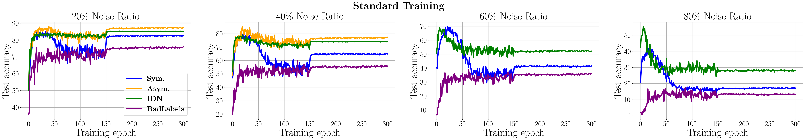
</p>
<p align="center">
    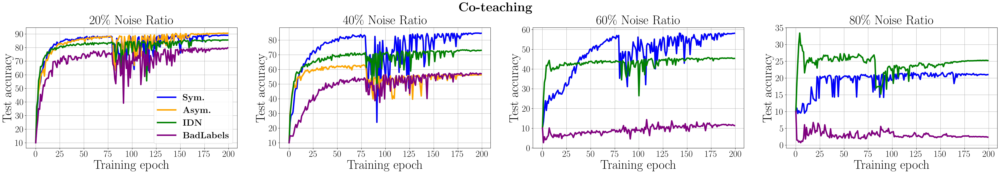
</p>
<p align="center">
    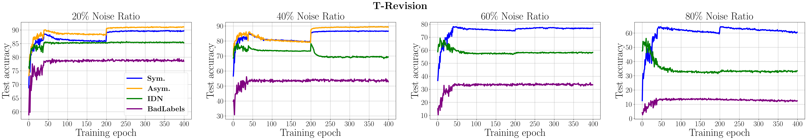
</p>
<p align="center">
    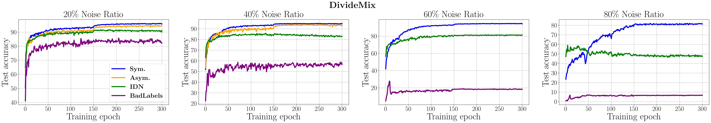
</p>
<p align="center">
    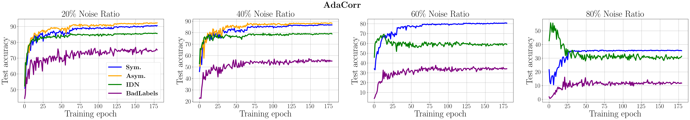
</p>
<p align="center">
    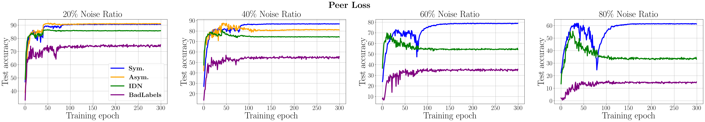
</p>
<p align="center">
    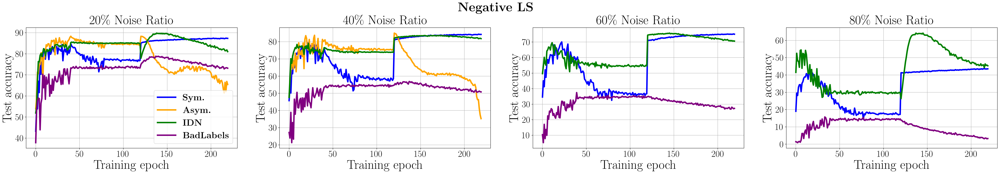
</p>
<p align="center">
    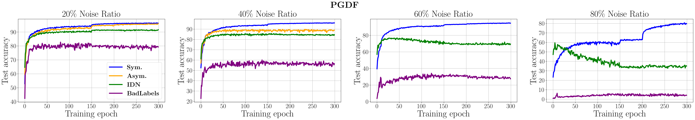
</p>
<p align="center">
    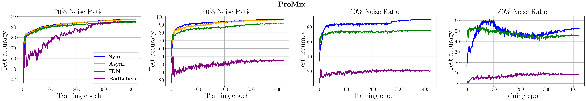
</p>
<p align="center">
    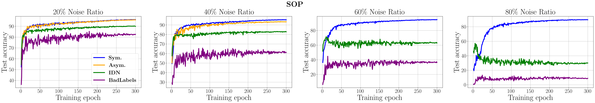
</p>
<p align="center" style="margin-top: 1px">
    < Learning curves of multiple LNL algorithms on CIFAR-10. >
</p>

<p align="center">
    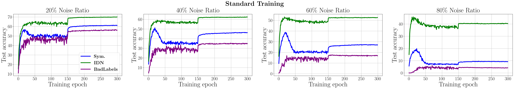
</p>
<p align="center">
    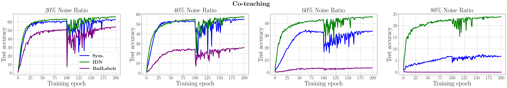
</p>
<p align="center">
    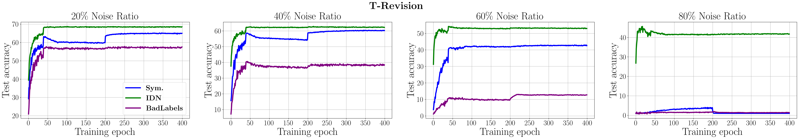
</p>
<p align="center">
    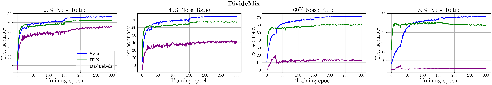
</p>
<p align="center">
    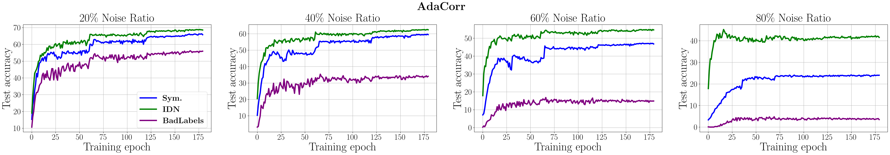
</p>
<p align="center">
    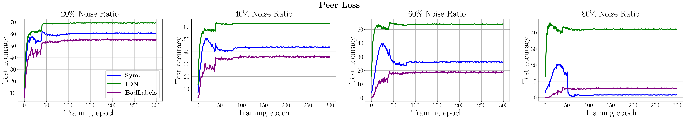
</p>
<p align="center">
    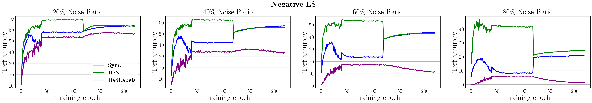
</p>
<p align="center">
    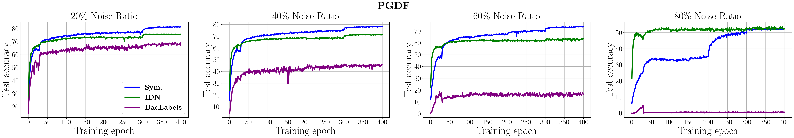
</p>
<p align="center">
    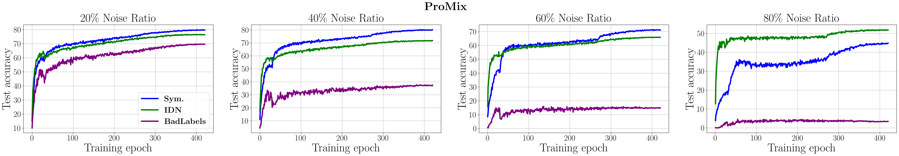
</p>
<p align="center">
    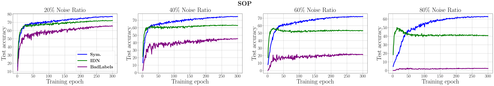
</p>
<p align="center">
    < Learning curves of multiple LNL algorithms on CIFAR-100. >
</p>


### Part 3: Evaluate Robust DivideMix
Run the following command to evaluate Robust DivideMix on different datasets.
```
cd robust_LNL_algo
./eval_robust_dividemix.sh
```

