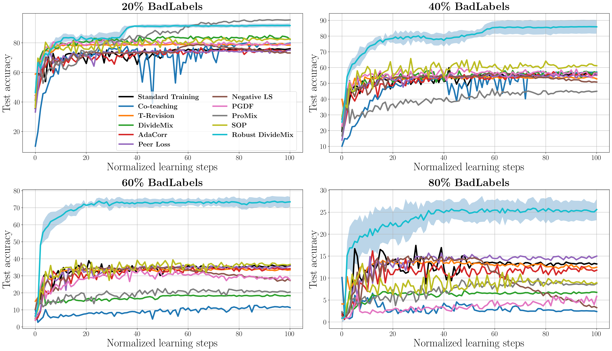
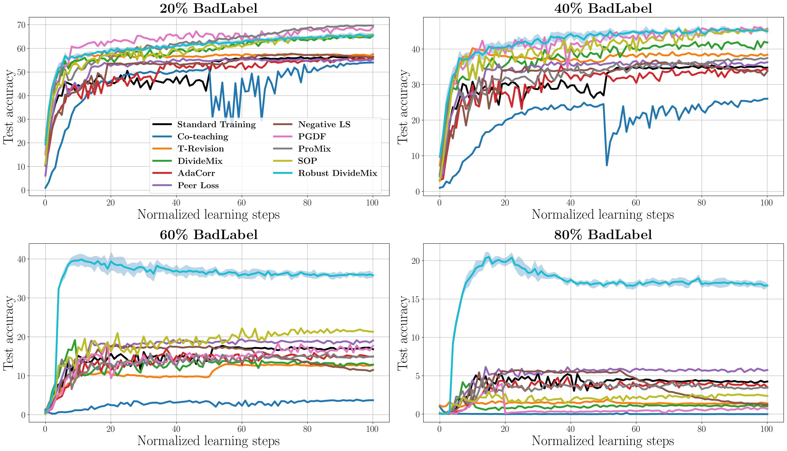

# BadLabel
The code repository for a challenging label noise called ***BadLabel*** and a robust label-noise learning (LNL) algorithm called ***Robust DivideMix***.\
The paper link: https://arxiv.org/abs/2305.18377 

This paper is accepted at IEEE TPAMI 2024.\
DOI: 10.1109/TPAMI.2024.3355425

## Prerequisites
Python (3.8)  
Pytorch (1.8.0)  
CUDA  
Numpy  

## Usage
### Part 1: Generate BadLabel
You can run the following command to synthesize BadLabel.
```
cd gen_badlabels
./gen_badlabels.sh
```

### Part 2: Evaluate BadLabel
Run the following command to automatically evaluate BadLabel on multiple LNL algorithms. 
Additionally, in this shell script, we provide the execution commands for each LNL algorithm and the hyperparameter settings we used. Based on this, you can also evaluate a specific LNL algorithm separately.
```
cd eval_badlabels
./eval_badlabels.sh
```

We have shared various label noises generated by us under the ***eval_badlabels/noise*** directory for quick experimental verification.

If you want to quickly evaluate BadLabel on your own algorithm, we also provide MNIST, CIFAR-10 and CIFAR-100 training sets with injected BadLabel in [Google Drive](https://drive.google.com/drive/folders/1ZGA2_KzYK8KCl89Zko4ahjnAk6s9K3pX?usp=sharing). You can easily load the datasets using ***load_badlabels_dataset.py*** under the ***eval_badlabels*** directory.

#### ***Evaluation results of BadLabel on CIFAR-10, CIFAR-100 and MNIST***
Here we share our evaluation results on CIFAR-10, CIFAR-100, and MNIST. 

We evaluated using Standard Training (no defense) [[paper](https://arxiv.org/pdf/1706.05394.pdf)] and 11 state-of-the-art LNL methods as baselines. 
Specifically, these methods are as follows: Co-teaching [[paper](https://arxiv.org/pdf/1804.06872.pdf), [code](https://github.com/bhanML/Co-teaching)], 
T-Revision [[paper](https://papers.nips.cc/paper_files/paper/2019/file/9308b0d6e5898366a4a986bc33f3d3e7-Paper.pdf), [code](https://github.com/xiaoboxia/T-Revision)], 
RoG [[paper](https://arxiv.org/pdf/1901.11300.pdf), [code](https://github.com/pokaxpoka/RoGNoisyLabel)], 
DivideMix [[paper](https://openreview.net/pdf?id=HJgExaVtwr), [code](https://github.com/LiJunnan1992/DivideMix)], 
AdaCorr [[paper](https://arxiv.org/pdf/2011.10077.pdf), [code](https://github.com/pingqingsheng/LRT)], 
Peer Loss [[paper](https://arxiv.org/pdf/1910.03231.pdf), [code](https://github.com/weijiaheng/Multi-class-Peer-Loss-functions)], 
ELR [[paper](https://arxiv.org/pdf/2007.00151.pdf), [code](https://github.com/shengliu66/ELR)], 
Negative LS [[paper](https://arxiv.org/pdf/2106.04149.pdf), [code](https://github.com/UCSC-REAL/negative-label-smoothing)], 
PGDF [[paper](https://arxiv.org/pdf/2112.01197.pdf), [code](https://github.com/bupt-ai-cz/PGDF)], 
ProMix [[paper](https://arxiv.org/pdf/2207.10276.pdf), [code](https://github.com/Justherozen/ProMix)], 
SOP [[paper](https://proceedings.mlr.press/v162/liu22w/liu22w.pdf), [code](https://github.com/shengliu66/SOP)].

<table style="font-size: 12px;">
    <caption style="font-size: 12px;">TABLE 1: Test accuracy (%) on CIFAR-10 with different types of label noise (symmetric, asymmetric, instance-dependent, and our proposed BadLabel) and noise levels (ranging from 20% to 80%). The most robust evaluations for each LNL method are highlighted in bold.</caption>
	<tr>
        <th colspan="2" rowspan="3"><sub>Method</sub></th>
	    <th colspan="14"><sub>Noise type / Noise ratio</sub></th>
	</tr >
    <tr>
        <th colspan="4"><sub>Sym.</sub></th>
        <th colspan="2"><sub>Asym.</sub></th>
        <th colspan="4"><sub>IDN</sub></th>
        <th colspan="4"><sub>BadLabel</sub></th>
    </tr>
    <tr align="center">
        <td><sub>20%</sub></td><td><sub>40%</sub></td><td><sub>60%</sub></td><td><sub>80%</sub></td><td><sub>20%</sub></td><td><sub>40%</sub></td><td><sub>20%</sub></td><td><sub>40%</sub></td><td><sub>60%</sub></td><td><sub>80%</sub></td><td><sub>20%</sub></td><td><sub>40%</sub></td><td><sub>60%</sub></td><td><sub>80%</sub></td>
    </tr>
    <tr align="center">
        <th rowspan="2"><sub><a href="https://arxiv.org/pdf/1706.05394.pdf">Standard Training</a></sub></th>
        <td><sub>Best</sub></td>
		<td><sub>85.21</sub></td><td><sub>79.90</sub></td><td><sub>69.79</sub></td><td><sub>43.00</sub></td><td><sub>88.02</sub></td><td><sub>85.22</sub></td><td><sub>85.42</sub></td><td><sub>78.93</sub></td><td><sub>68.97</sub></td><td><sub>55.34</sub></td><th><sub>76.76±1.08</sub></th><th><sub>58.79±1.49</sub></th><th><sub>39.64±1.13</sub></th><th><sub>17.80±0.91</sub></th>    </tr>
    <tr align="center">
        <td><sub>Last</sub></td>
		<td><sub>82.55</sub></td><td><sub>64.79</sub></td><td><sub>41.43</sub></td><td><sub>17.20</sub></td><td><sub>87.28</sub></td><td><sub>77.04</sub></td><td><sub>85.23</sub></td><td><sub>74.06</sub></td><td><sub>52.22</sub></td><td><sub>28.04</sub></td><th><sub>75.31±0.24</sub></th><th><sub>55.72±0.17</sub></th><th><sub>35.66±0.23</sub></th><th><sub>13.44±0.26</sub></th>    </tr>
    <tr align="center">
        <th rowspan="2"><sub><a href="https://arxiv.org/pdf/1804.06872.pdf">Co-teaching</a></sub></th>
        <td><sub>Best</sub></td>
		<td><sub>89.19</sub></td><td><sub>84.80</sub></td><td><sub>58.25</sub></td><td><sub>21.76</sub></td><td><sub>90.65</sub></td><td><sub>63.11</sub></td><td><sub>85.72</sub></td><td><sub>73.42</sub></td><td><sub>45.84</sub></td><td><sub>33.43</sub></td><th><sub>80.41±0.78</sub></th><th><sub>56.81±3.86</sub></th><th><sub>14.42±1.22</sub></th><th><sub>10.51±0.71</sub></th>    </tr>
    <tr align="center">
        <td><sub>Last</sub></td>
		<td><sub>89.03</sub></td><td><sub>84.65</sub></td><td><sub>57.95</sub></td><td><sub>21.06</sub></td><td><sub>90.52</sub></td><td><sub>56.33</sub></td><td><sub>85.48</sub></td><td><sub>72.97</sub></td><td><sub>45.53</sub></td><td><sub>25.27</sub></td><th><sub>79.48±0.75</sub></th><th><sub>55.54±3.74</sub></th><th><sub>12.99±1.09</sub></th><th><sub>4.24±2.44</sub></th>    </tr>
    <tr align="center">
        <th rowspan="2"><sub><a href="https://papers.nips.cc/paper_files/paper/2019/file/9308b0d6e5898366a4a986bc33f3d3e7-Paper.pdf">T-Revision</a></sub></th>
        <td><sub>Best</sub></td>
		<td><sub>89.79</sub></td><td><sub>86.83</sub></td><td><sub>78.14</sub></td><td><sub>64.54</sub></td><td><sub>91.23</sub></td><td><sub>89.60</sub></td><td><sub>85.74</sub></td><td><sub>78.45</sub></td><td><sub>69.31</sub></td><td><sub>56.26</sub></td><th><sub>76.99±1.38</sub></th><th><sub>57.21±1.64</sub></th><th><sub>36.01±1.10</sub></th><th><sub>14.93±0.50</sub></th>    </tr>
    <tr align="center">
        <td><sub>Last</sub></td>
		<td><sub>89.59</sub></td><td><sub>86.57</sub></td><td><sub>76.85</sub></td><td><sub>60.54</sub></td><td><sub>91.09</sub></td><td><sub>89.40</sub></td><td><sub>85.43</sub></td><td><sub>69.18</sub></td><td><sub>58.15</sub></td><td><sub>33.15</sub></td><th><sub>75.71±1.68</sub></th><th><sub>55.02±1.34</sub></th><th><sub>33.99±0.29</sub></th><th><sub>13.16±0.68</sub></th>    </tr>
    <tr align="center">
        <th rowspan="2"><sub><a href="https://arxiv.org/pdf/1901.11300.pdf">RoG</a></sub></th>
        <td><sub>Best</sub></td>
		<td><sub>-</sub></td><td><sub>-</sub></td><td><sub>-</sub></td><td><sub>-</sub></td><td><sub>-</sub></td><td><sub>-</sub></td><td><sub>-</sub></td><td><sub>-</sub></td><td><sub>-</sub></td><td><sub>-</sub></td><td><sub>-</sub></td><td><sub>-</sub></td><td><sub>-</sub></td><td><sub>-</sub></td>    </tr>
    <tr align="center">
        <td><sub>Last</sub></td>
		<td><sub>87.48</sub></td><td><sub>74.81</sub></td><td><sub>52.42</sub></td><td><sub>16.02</sub></td><td><sub>89.61</sub></td><td><sub>81.63</sub></td><th><sub>85.34</sub></th><td><sub>76.68</sub></td><td><sub>63.79</sub></td><td><sub>37.11</sub></td><td><sub>85.88±0.32</sub></td><th><sub>64.20±0.91</sub></th><th><sub>35.89±1.34</sub></th><th><sub>8.64±0.76</sub></th>    </tr>
    <tr align="center">
        <th rowspan="2"><sub><a href="https://openreview.net/pdf?id=HJgExaVtwr">DivideMix</a></sub></th>
        <td><sub>Best</sub></td>
		<td><sub>96.21</sub></td><td><sub>95.08</sub></td><td><sub>94.80</sub></td><td><sub>81.95</sub></td><td><sub>94.82</sub></td><td><sub>94.20</sub></td><td><sub>91.97</sub></td><td><sub>85.84</sub></td><td><sub>81.59</sub></td><td><sub>59.06</sub></td><th><sub>84.81±0.78</sub></th><th><sub>58.44±1.45</sub></th><th><sub>28.38±0.56</sub></th><th><sub>6.87±0.59</sub></th>    </tr>
    <tr align="center">
        <td><sub>Last</sub></td>
		<td><sub>96.04</sub></td><td><sub>94.74</sub></td><td><sub>94.56</sub></td><td><sub>81.58</sub></td><td><sub>94.46</sub></td><td><sub>93.50</sub></td><td><sub>90.77</sub></td><td><sub>82.94</sub></td><td><sub>81.19</sub></td><td><sub>47.81</sub></td><th><sub>82.13±0.78</sub></th><th><sub>57.65±1.96</sub></th><th><sub>16.21±1.24</sub></th><th><sub>6.12±0.45</sub></th>    </tr>
    <tr align="center">
        <th rowspan="2"><sub><a href="https://arxiv.org/pdf/2011.10077.pdf">AdaCorr</a></sub></th>
        <td><sub>Best</sub></td>
		<td><sub>90.66</sub></td><td><sub>87.17</sub></td><td><sub>80.97</sub></td><td><sub>35.97</sub></td><td><sub>92.35</sub></td><td><sub>88.60</sub></td><td><sub>85.88</sub></td><td><sub>79.54</sub></td><td><sub>69.36</sub></td><td><sub>55.86</sub></td><th><sub>76.97±0.83</sub></th><th><sub>57.17±0.71</sub></th><th><sub>37.14±0.38</sub></th><th><sub>14.72±0.86</sub></th>    </tr>
    <tr align="center">
        <td><sub>Last</sub></td>
		<td><sub>90.46</sub></td><td><sub>86.78</sub></td><td><sub>80.66</sub></td><td><sub>35.67</sub></td><td><sub>92.17</sub></td><td><sub>88.34</sub></td><td><sub>85.70</sub></td><td><sub>79.05</sub></td><td><sub>59.13</sub></td><td><sub>30.48</sub></td><th><sub>74.71±0.26</sub></th><th><sub>54.92±0.22</sub></th><th><sub>34.71±0.22</sub></th><th><sub>11.94±0.12</sub></th>    </tr>
    <tr align="center">
        <th rowspan="2"><sub><a href="https://arxiv.org/pdf/1910.03231.pdf">Peer Loss</a></sub></th>
        <td><sub>Best</sub></td>
		<td><sub>90.87</sub></td><td><sub>87.13</sub></td><td><sub>79.03</sub></td><td><sub>61.91</sub></td><td><sub>91.47</sub></td><td><sub>87.50</sub></td><td><sub>86.46</sub></td><td><sub>81.07</sub></td><td><sub>69.87</sub></td><td><sub>55.51</sub></td><th><sub>75.28±1.43</sub></th><th><sub>55.75±1.39</sub></th><th><sub>36.17±0.23</sub></th><th><sub>15.87±0.30</sub></th>    </tr>
    <tr align="center">
        <td><sub>Last</sub></td>
		<td><sub>90.65</sub></td><td><sub>86.85</sub></td><td><sub>78.83</sub></td><td><sub>61.43</sub></td><td><sub>91.11</sub></td><td><sub>81.24</sub></td><td><sub>85.72</sub></td><td><sub>74.43</sub></td><td><sub>54.57</sub></td><td><sub>33.76</sub></td><th><sub>74.00±1.43</sub></th><th><sub>53.73±1.25</sub></th><th><sub>34.37±0.68</sub></th><th><sub>14.71±0.22</sub></th>    </tr>
    <tr align="center">
        <th rowspan="2"><sub><a href="https://arxiv.org/pdf/2007.00151.pdf">ELR</a></sub></th>
        <td><sub>Best</sub></td>
		<td><sub>92.85</sub></td><td><sub>91.30</sub></td><td><sub>87.99</sub></td><td><sub>54.67</sub></td><td><sub>92.42</sub></td><td><sub>89.40</sub></td><td><sub>87.62</sub></td><td><sub>82.08</sub></td><td><sub>73.23</sub></td><td><sub>57.26</sub></td><th><sub>85.73±0.15</sub></th><th><sub>62.58±1.33</sub></th><th><sub>35.24±1.12</sub></th><th><sub>11.71±0.70</sub></th>    </tr>
    <tr align="center">
        <td><sub>Last</sub></td>
		<td><sub>89.37</sub></td><td><sub>87.78</sub></td><td><sub>85.69</sub></td><td><sub>46.71</sub></td><td><sub>92.31</sub></td><td><sub>89.11</sub></td><td><sub>85.31</sub></td><td><sub>78.05</sub></td><td><sub>68.12</sub></td><td><sub>48.99</sub></td><th><sub>81.88±0.25</sub></th><th><sub>56.45±0.31</sub></th><th><sub>30.45±0.30</sub></th><th><sub>8.67±0.79</sub></th>    </tr>
    <tr align="center">
        <th rowspan="2"><sub><a href="https://arxiv.org/pdf/2106.04149.pdf">Negative LS</a></sub></th>
        <td><sub>Best</sub></td>
		<td><sub>87.42</sub></td><td><sub>84.40</sub></td><td><sub>75.22</sub></td><td><sub>43.62</sub></td><td><sub>88.34</sub></td><td><sub>85.03</sub></td><td><sub>89.82</sub></td><td><sub>83.66</sub></td><td><sub>75.76</sub></td><td><sub>64.21</sub></td><th><sub>78.77±0.66</sub></th><th><sub>57.68±0.89</sub></th><th><sub>36.57±0.88</sub></th><th><sub>16.46±0.82</sub></th>    </tr>
    <tr align="center">
        <td><sub>Last</sub></td>
		<td><sub>87.30</sub></td><td><sub>84.21</sub></td><td><sub>75.07</sub></td><td><sub>43.50</sub></td><th><sub>65.23</sub></th><th><sub>47.22</sub></th><td><sub>81.87</sub></td><td><sub>82.10</sub></td><td><sub>70.95</sub></td><td><sub>45.62</sub></td><td><sub>73.99±0.90</sub></td><td><sub>52.45±1.03</sub></td><th><sub>26.66±0.81</sub></th><th><sub>3.21±0.44</sub></th>    </tr>
    <tr align="center">
        <th rowspan="2"><sub><a href="https://arxiv.org/pdf/2112.01197.pdf">PGDF</a></sub></th>
        <td><sub>Best</sub></td>
		<td><sub>96.63</sub></td><td><sub>96.12</sub></td><td><sub>95.05</sub></td><td><sub>80.69</sub></td><td><sub>96.05</sub></td><td><sub>89.87</sub></td><td><sub>91.81</sub></td><td><sub>85.75</sub></td><td><sub>76.84</sub></td><td><sub>59.60</sub></td><th><sub>82.72±0.47</sub></th><th><sub>61.50±1.87</sub></th><th><sub>34.46±1.44</sub></th><th><sub>6.37±0.34</sub></th>    </tr>
    <tr align="center">
        <td><sub>Last</sub></td>
		<td><sub>96.40</sub></td><td><sub>95.95</sub></td><td><sub>94.75</sub></td><td><sub>79.76</sub></td><td><sub>95.74</sub></td><td><sub>88.45</sub></td><td><sub>91.30</sub></td><td><sub>84.31</sub></td><td><sub>69.54</sub></td><td><sub>34.81</sub></td><th><sub>79.95±0.36</sub></th><th><sub>56.26±1.03</sub></th><th><sub>30.14±0.85</sub></th><th><sub>4.56±0.45</sub></th>    </tr>
    <tr align="center">
        <th rowspan="2"><sub><a href="https://arxiv.org/pdf/2207.10276.pdf">ProMix</a></sub></th>
        <td><sub>Best</sub></td>
		<td><sub>97.40</sub></td><td><sub>96.98</sub></td><td><sub>90.80</sub></td><td><sub>61.15</sub></td><td><sub>97.04</sub></td><td><sub>96.09</sub></td><td><sub>94.72</sub></td><td><sub>91.32</sub></td><td><sub>76.22</sub></td><td><sub>54.01</sub></td><th><sub>94.95±1.43</sub></th><th><sub>48.36±1.72</sub></th><th><sub>24.87±1.47</sub></th><th><sub>9.51±1.51</sub></th>    </tr>
    <tr align="center">
        <td><sub>Last</sub></td>
		<td><sub>97.30</sub></td><td><sub>96.91</sub></td><td><sub>90.72</sub></td><td><sub>52.25</sub></td><td><sub>96.94</sub></td><td><sub>96.03</sub></td><td><sub>94.63</sub></td><td><sub>91.01</sub></td><td><sub>75.12</sub></td><td><sub>45.80</sub></td><th><sub>94.59±1.64</sub></th><th><sub>44.08±0.49</sub></th><th><sub>21.33±0.46</sub></th><th><sub>7.93±1.34</sub></th>    </tr>
    <tr align="center">
        <th rowspan="2"><sub><a href="https://proceedings.mlr.press/v162/liu22w/liu22w.pdf">SOP</a></sub></th>
        <td><sub>Best</sub></td>
		<td><sub>96.17</sub></td><td><sub>95.64</sub></td><td><sub>94.83</sub></td><td><sub>89.94</sub></td><td><sub>95.96</sub></td><td><sub>93.60</sub></td><td><sub>90.32</sub></td><td><sub>83.26</sub></td><td><sub>71.54</sub></td><td><sub>57.14</sub></td><th><sub>84.96±0.35</sub></th><th><sub>66.25±1.35</sub></th><th><sub>42.59±1.25</sub></th><th><sub>12.70±0.89</sub></th>    </tr>
    <tr align="center">
        <td><sub>Last</sub></td>
		<td><sub>96.12</sub></td><td><sub>95.46</sub></td><td><sub>94.71</sub></td><td><sub>89.78</sub></td><td><sub>95.86</sub></td><td><sub>93.30</sub></td><td><sub>90.13</sub></td><td><sub>82.91</sub></td><td><sub>63.14</sub></td><td><sub>29.86</sub></td><th><sub>82.64±0.27</sub></th><th><sub>61.89±0.25</sub></th><th><sub>36.51±0.26</sub></th><th><sub>8.63±0.17</sub></th>    </tr>
</table>

<table style="font-size: 12px;">
    <caption style="font-size: 12px;">TABLE 2: Test accuracy (%) on CIFAR-100 with different types of label noise (symmetric, instance-dependent, and our proposed BadLabel) and noise levels (ranging from 20% to 80%). The most robust evaluations for each LNL method are highlighted in bold.</caption>
	<tr>
        <th colspan="2" rowspan="3"><sub>Method</sub></th>
	    <th colspan="12"><sub>Noise type / Noise ratio</sub></th>
	</tr >
    <tr>
        <th colspan="4"><sub>Sym.</sub></th>
        <th colspan="4"><sub>IDN</sub></th>
        <th colspan="4"><sub>BadLabel</sub></th>
    </tr>
    <tr align="center">
        <td><sub>20%</sub></td><td><sub>40%</sub></td><td><sub>60%</sub></td><td><sub>80%</sub></td><td><sub>20%</sub></td><td><sub>40%</sub></td><td><sub>60%</sub></td><td><sub>80%</sub></td><td><sub>20%</sub></td><td><sub>40%</sub></td><td><sub>60%</sub></td><td><sub>80%</sub></td>
    </tr>
    <tr align="center">
        <th rowspan="2"><sub><a href="https://arxiv.org/pdf/1706.05394.pdf">Standard Training</a></sub></th>
        <td><sub>Best</sub></td>
		<td><sub>61.41</sub></td><td><sub>51.21</sub></td><td><sub>38.82</sub></td><td><sub>19.89</sub></td><td><sub>70.06</sub></td><td><sub>62.48</sub></td><td><sub>53.21</sub></td><td><sub>45.77</sub></td><th><sub>56.75±0.98</sub></th><th><sub>35.42±0.77</sub></th><th><sub>17.70±1.02</sub></th><th><sub>6.03±0.24</sub></th>    </tr>
    <tr align="center">
        <td><sub>Last</sub></td>
		<td><sub>61.17</sub></td><td><sub>46.27</sub></td><td><sub>27.01</sub></td><td><sub>9.27</sub></td><td><sub>69.94</sub></td><td><sub>62.32</sub></td><td><sub>52.55</sub></td><td><sub>40.45</sub></td><th><sub>56.30±0.13</sub></th><th><sub>34.90±0.17</sub></th><th><sub>17.05±0.28</sub></th><th><sub>4.18±0.16</sub></th>    </tr>
    <tr align="center">
        <th rowspan="2"><sub><a href="https://arxiv.org/pdf/1804.06872.pdf">Co-teaching</a></sub></th>
        <td><sub>Best</sub></td>
		<td><sub>62.80</sub></td><td><sub>55.02</sub></td><td><sub>34.66</sub></td><td><sub>7.72</sub></td><td><sub>66.16</sub></td><td><sub>57.55</sub></td><td><sub>45.38</sub></td><td><sub>23.83</sub></td><th><sub>54.30±0.78</sub></th><th><sub>26.02±2.13</sub></th><th><sub>3.97±0.11</sub></th><th><sub>0.99±0.21</sub></th>    </tr>
    <tr align="center">
        <td><sub>Last</sub></td>
		<td><sub>62.35</sub></td><td><sub>54.84</sub></td><td><sub>33.44</sub></td><td><sub>6.78</sub></td><td><sub>66.02</sub></td><td><sub>57.33</sub></td><td><sub>45.24</sub></td><td><sub>23.72</sub></td><th><sub>53.97±0.71</sub></th><th><sub>25.74±1.21</sub></th><th><sub>3.67±0.14</sub></th><th><sub>0.00±0.00</sub></th>    </tr>
    <tr align="center">
        <th rowspan="2"><sub><a href="https://papers.nips.cc/paper_files/paper/2019/file/9308b0d6e5898366a4a986bc33f3d3e7-Paper.pdf">T-Revision</a></sub></th>
        <td><sub>Best</sub></td>
		<td><sub>65.19</sub></td><td><sub>60.43</sub></td><td><sub>43.01</sub></td><td><sub>4.03</sub></td><td><sub>68.77</sub></td><td><sub>62.86</sub></td><td><sub>54.23</sub></td><td><sub>45.67</sub></td><th><sub>57.86±1.02</sub></th><th><sub>40.60±1.33</sub></th><th><sub>13.06±1.20</sub></th><th><sub>1.92±0.56</sub></th>    </tr>
    <tr align="center">
        <td><sub>Last</sub></td>
		<td><sub>64.95</sub></td><td><sub>60.26</sub></td><td><sub>42.77</sub></td><td><sub>3.12</sub></td><td><sub>68.53</sub></td><td><sub>62.39</sub></td><td><sub>53.07</sub></td><td><sub>41.85</sub></td><th><sub>57.26±1.54</sub></th><th><sub>38.40±0.96</sub></th><th><sub>12.65±0.58</sub></th><th><sub>1.43±0.95</sub></th>    </tr>
    <tr align="center">
        <th rowspan="2"><sub><a href="https://arxiv.org/pdf/1901.11300.pdf">RoG</a></sub></th>
        <td><sub>Best</sub></td>
		<td><sub>-</sub></td><td><sub>-</sub></td><td><sub>-</sub></td><td><sub>-</sub></td><td><sub>-</sub></td><td><sub>-</sub></td><td><sub>-</sub></td><td><sub>-</sub></td><td><sub>-</sub></td><td><sub>-</sub></td><td><sub>-</sub></td><td><sub>-</sub></td>    </tr>
    <tr align="center">
        <td><sub>Last</sub></td>
		<td><sub>66.68</sub></td><td><sub>60.79</sub></td><td><sub>53.08</sub></td><td><sub>22.73</sub></td><th><sub>66.39</sub></th><td><sub>60.80</sub></td><td><sub>56.00</sub></td><td><sub>48.62</sub></td><td><sub>70.55±0.55</sub></td><th><sub>58.61±0.65</sub></th><th><sub>25.74±0.28</sub></th><th><sub>4.13±0.41</sub></th>    </tr>
    <tr align="center">
        <th rowspan="2"><sub><a href="https://openreview.net/pdf?id=HJgExaVtwr">DivideMix</a></sub></th>
        <td><sub>Best</sub></td>
		<td><sub>77.36</sub></td><td><sub>75.02</sub></td><td><sub>72.25</sub></td><td><sub>57.56</sub></td><td><sub>72.79</sub></td><td><sub>67.82</sub></td><td><sub>61.08</sub></td><td><sub>51.50</sub></td><th><sub>65.55±0.65</sub></th><th><sub>42.72±0.44</sub></th><th><sub>19.17±1.28</sub></th><th><sub>4.67±0.87</sub></th>    </tr>
    <tr align="center">
        <td><sub>Last</sub></td>
		<td><sub>76.87</sub></td><td><sub>74.66</sub></td><td><sub>71.91</sub></td><td><sub>57.08</sub></td><td><sub>72.50</sub></td><td><sub>67.37</sub></td><td><sub>60.55</sub></td><td><sub>47.86</sub></td><th><sub>64.96±0.47</sub></th><th><sub>40.92±0.36</sub></th><th><sub>13.04±0.85</sub></th><th><sub>1.10±0.21</sub></th>    </tr>
    <tr align="center">
        <th rowspan="2"><sub><a href="https://arxiv.org/pdf/2011.10077.pdf">AdaCorr</a></sub></th>
        <td><sub>Best</sub></td>
		<td><sub>66.31</sub></td><td><sub>59.78</sub></td><td><sub>47.22</sub></td><td><sub>24.15</sub></td><td><sub>68.89</sub></td><td><sub>62.63</sub></td><td><sub>54.91</sub></td><td><sub>45.22</sub></td><th><sub>56.22±0.82</sub></th><th><sub>35.38±1.27</sub></th><th><sub>16.87±1.36</sub></th><th><sub>4.81±0.22</sub></th>    </tr>
    <tr align="center">
        <td><sub>Last</sub></td>
		<td><sub>66.03</sub></td><td><sub>59.48</sub></td><td><sub>47.04</sub></td><td><sub>23.90</sub></td><td><sub>68.72</sub></td><td><sub>62.45</sub></td><td><sub>54.68</sub></td><td><sub>41.95</sub></td><th><sub>55.69±0.44</sub></th><th><sub>33.88±0.88</sub></th><th><sub>14.88±0.52</sub></th><th><sub>3.76±1.24</sub></th>    </tr>
    <tr align="center">
        <th rowspan="2"><sub><a href="https://arxiv.org/pdf/1910.03231.pdf">Peer Loss</a></sub></th>
        <td><sub>Best</sub></td>
		<td><sub>61.97</sub></td><td><sub>51.09</sub></td><td><sub>39.98</sub></td><td><sub>18.82</sub></td><td><sub>69.63</sub></td><td><sub>63.32</sub></td><td><sub>55.01</sub></td><td><sub>46.20</sub></td><th><sub>55.58±1.79</sub></th><th><sub>37.11±2.01</sub></th><th><sub>19.53±1.29</sub></th><th><sub>6.42±0.52</sub></th>    </tr>
    <tr align="center">
        <td><sub>Last</sub></td>
		<td><sub>60.64</sub></td><td><sub>43.64</sub></td><td><sub>26.23</sub></td><td><sub>7.65</sub></td><td><sub>69.38</sub></td><td><sub>62.70</sub></td><td><sub>53.90</sub></td><td><sub>42.14</sub></td><th><sub>55.00±1.41</sub></th><th><sub>35.85±1.48</sub></th><th><sub>18.65±0.22</sub></th><th><sub>5.74±0.76</sub></th>    </tr>
    <tr align="center">
        <th rowspan="2"><sub><a href="https://arxiv.org/pdf/2007.00151.pdf">ELR</a></sub></th>
        <td><sub>Best</sub></td>
		<td><sub>72.55</sub></td><td><sub>68.75</sub></td><td><sub>60.01</sub></td><td><sub>26.89</sub></td><td><sub>70.27</sub></td><td><sub>66.04</sub></td><td><sub>60.59</sub></td><td><sub>52.81</sub></td><th><sub>68.21±0.62</sub></th><th><sub>43.75±0.21</sub></th><th><sub>14.39±0.35</sub></th><th><sub>1.09±0.18</sub></th>    </tr>
    <tr align="center">
        <td><sub>Last</sub></td>
		<td><sub>72.13</sub></td><td><sub>68.60</sub></td><td><sub>59.78</sub></td><td><sub>23.95</sub></td><td><sub>70.13</sub></td><td><sub>65.87</sub></td><td><sub>60.41</sub></td><td><sub>52.57</sub></td><th><sub>67.97±0.17</sub></th><th><sub>43.40±0.22</sub></th><th><sub>13.97±0.38</sub></th><th><sub>0.98±0.11</sub></th>    </tr>
    <tr align="center">
        <th rowspan="2"><sub><a href="https://arxiv.org/pdf/2106.04149.pdf">Negative LS</a></sub></th>
        <td><sub>Best</sub></td>
		<td><sub>63.65</sub></td><td><sub>57.17</sub></td><td><sub>44.18</sub></td><td><sub>21.31</sub></td><td><sub>69.20</sub></td><td><sub>62.67</sub></td><td><sub>54.49</sub></td><td><sub>46.96</sub></td><th><sub>57.76±0.56</sub></th><th><sub>36.80±0.21</sub></th><th><sub>17.96±0.31</sub></th><th><sub>5.88±0.11</sub></th>    </tr>
    <tr align="center">
        <td><sub>Last</sub></td>
		<td><sub>63.54</sub></td><td><sub>56.98</sub></td><td><sub>43.98</sub></td><td><sub>21.19</sub></td><td><sub>63.38</sub></td><td><sub>55.72</sub></td><td><sub>42.87</sub></td><td><sub>24.69</sub></td><th><sub>56.42±0.71</sub></th><th><sub>33.38±0.22</sub></th><th><sub>11.42±0.38</sub></th><th><sub>1.28±0.14</sub></th>    </tr>
    <tr align="center">
        <th rowspan="2"><sub><a href="https://arxiv.org/pdf/2112.01197.pdf">PGDF</a></sub></th>
        <td><sub>Best</sub></td>
		<td><sub>81.90</sub></td><td><sub>78.50</sub></td><td><sub>74.05</sub></td><td><sub>52.48</sub></td><td><sub>75.87</sub></td><td><sub>71.72</sub></td><td><sub>62.76</sub></td><td><sub>53.16</sub></td><th><sub>69.44±0.26</sub></th><th><sub>46.39±0.39</sub></th><th><sub>19.05±0.37</sub></th><th><sub>5.08±0.13</sub></th>    </tr>
    <tr align="center">
        <td><sub>Last</sub></td>
		<td><sub>81.37</sub></td><td><sub>78.21</sub></td><td><sub>73.64</sub></td><td><sub>52.11</sub></td><td><sub>74.90</sub></td><td><sub>71.32</sub></td><td><sub>62.06</sub></td><td><sub>51.68</sub></td><th><sub>68.18±0.16</sub></th><th><sub>45.38±0.15</sub></th><th><sub>16.84±0.24</sub></th><th><sub>0.72±0.25</sub></th>    </tr>
    <tr align="center">
        <th rowspan="2"><sub><a href="https://arxiv.org/pdf/2207.10276.pdf">ProMix</a></sub></th>
        <td><sub>Best</sub></td>
		<td><sub>79.99</sub></td><td><sub>80.21</sub></td><td><sub>71.44</sub></td><td><sub>44.97</sub></td><td><sub>76.61</sub></td><td><sub>71.92</sub></td><td><sub>66.04</sub></td><td><sub>51.96</sub></td><th><sub>69.80±1.58</sub></th><th><sub>37.73±1.09</sub></th><th><sub>15.92±1.88</sub></th><th><sub>4.62±0.95</sub></th>    </tr>
    <tr align="center">
        <td><sub>Last</sub></td>
		<td><sub>79.77</sub></td><td><sub>79.95</sub></td><td><sub>71.25</sub></td><td><sub>44.64</sub></td><td><sub>76.44</sub></td><td><sub>71.66</sub></td><td><sub>65.94</sub></td><td><sub>51.77</sub></td><th><sub>69.68±0.99</sub></th><th><sub>37.24±0.84</sub></th><th><sub>14.88±1.02</sub></th><th><sub>3.42±0.22</sub></th>    </tr>
    <tr align="center">
        <th rowspan="2"><sub><a href="https://proceedings.mlr.press/v162/liu22w/liu22w.pdf">SOP</a></sub></th>
        <td><sub>Best</sub></td>
		<td><sub>77.35</sub></td><td><sub>75.20</sub></td><td><sub>72.39</sub></td><td><sub>63.13</sub></td><td><sub>72.52</sub></td><td><sub>63.84</sub></td><td><sub>56.79</sub></td><td><sub>50.20</sub></td><th><sub>65.80±0.68</sub></th><th><sub>45.61±0.34</sub></th><th><sub>22.68±0.27</sub></th><th><sub>2.88±0.11</sub></th>    </tr>
    <tr align="center">
        <td><sub>Last</sub></td>
		<td><sub>77.11</sub></td><td><sub>74.89</sub></td><td><sub>72.10</sub></td><td><sub>62.87</sub></td><td><sub>72.11</sub></td><td><sub>63.15</sub></td><td><sub>53.35</sub></td><td><sub>40.77</sub></td><th><sub>65.51±0.12</sub></th><th><sub>45.24±0.26</sub></th><th><sub>21.55±0.18</sub></th><th><sub>2.48±0.16</sub></th>    </tr>
</table>

<table style="font-size: 12px;">
    <caption style="font-size: 12px;">TABLE 3: Test accuracy (%) on MNIST with different types of label noise (symmetric, instance-dependent, and our proposed BadLabel) and noise levels (ranging from 20% to 80%). The most robust evaluations for each LNL method are highlighted in bold.</caption>
	<tr>
        <th colspan="2" rowspan="3"><sub>Method</sub></th>
	    <th colspan="12"><sub>Noise type / Noise ratio</sub></th>
	</tr >
    <tr>
        <th colspan="4"><sub>Sym.</sub></th>
        <th colspan="4"><sub>IDN</sub></th>
        <th colspan="4"><sub>BadLabel</sub></th>
    </tr>
    <tr align="center">
        <td><sub>20%</sub></td><td><sub>40%</sub></td><td><sub>60%</sub></td><td><sub>80%</sub></td><td><sub>20%</sub></td><td><sub>40%</sub></td><td><sub>60%</sub></td><td><sub>80%</sub></td><td><sub>20%</sub></td><td><sub>40%</sub></td><td><sub>60%</sub></td><td><sub>80%</sub></td>
    </tr>
    <tr align="center">
        <th rowspan="2"><sub><a href="https://arxiv.org/pdf/1706.05394.pdf">Standard Training</a></sub></th>
        <td><sub>Best</sub></td>
		<td><sub>98.68</sub></td><td><sub>97.47</sub></td><td><sub>97.05</sub></td><td><sub>77.65</sub></td><td><sub>93.27</sub></td><td><sub>77.08</sub></td><td><sub>53.78</sub></td><td><sub>34.49</sub></td><th><sub>87.75</sub></th><th><sub>74.37</sub></th><th><sub>45.66</sub></th><th><sub>23.87</sub></th>    </tr>
    <tr align="center">
        <td><sub>Last</sub></td>
		<td><sub>94.29</sub></td><td><sub>80.32</sub></td><td><sub>51.78</sub></td><td><sub>22.29</sub></td><td><sub>87.72</sub></td><td><sub>70.86</sub></td><td><sub>47.70</sub></td><td><sub>23.55</sub></td><th><sub>82.53</sub></th><th><sub>61.31</sub></th><th><sub>39.01</sub></th><th><sub>15.93</sub></th>    </tr>
    <tr align="center">
        <th rowspan="2"><sub><a href="https://arxiv.org/pdf/1804.06872.pdf">Co-teaching</a></sub></th>
        <td><sub>Best</sub></td>
		<td><sub>99.19</sub></td><td><sub>98.96</sub></td><td><sub>98.73</sub></td><td><sub>77.30</sub></td><td><sub>93.91</sub></td><td><sub>83.84</sub></td><td><sub>63.26</sub></td><td><sub>30.07</sub></td><th><sub>90.04</sub></th><th><sub>67.44</sub></th><th><sub>42.88</sub></th><th><sub>11.59</sub></th>    </tr>
    <tr align="center">
        <td><sub>Last</sub></td>
		<td><sub>97.28</sub></td><td><sub>94.88</sub></td><td><sub>92.09</sub></td><td><sub>70.10</sub></td><td><sub>91.92</sub></td><td><sub>74.40</sub></td><td><sub>57.73</sub></td><td><sub>28.05</sub></td><th><sub>87.37</sub></th><th><sub>60.01</sub></th><th><sub>11.33</sub></th><th><sub>10.13</sub></th>    </tr>
    <tr align="center">
        <th rowspan="2"><sub><a href="https://papers.nips.cc/paper_files/paper/2019/file/9308b0d6e5898366a4a986bc33f3d3e7-Paper.pdf">T-Revision</a></sub></th>
        <td><sub>Best</sub></td>
		<td><sub>99.24</sub></td><td><sub>99.06</sub></td><td><sub>98.56</sub></td><td><sub>96.24</sub></td><td><sub>90.90</sub></td><td><sub>78.82</sub></td><td><sub>58.58</sub></td><th><sub>11.49</sub></th><th><sub>85.34</sub></th><th><sub>69.27</sub></th><th><sub>45.48</sub></th><td><sub>21.83</sub></td>    </tr>
    <tr align="center">
        <td><sub>Last</sub></td>
		<td><sub>99.15</sub></td><td><sub>99.02</sub></td><td><sub>98.44</sub></td><td><sub>96.14</sub></td><td><sub>87.74</sub></td><td><sub>69.92</sub></td><td><sub>46.17</sub></td><th><sub>11.35</sub></th><th><sub>81.99</sub></th><th><sub>60.24</sub></th><th><sub>38.26</sub></th><td><sub>16.48</sub></td>    </tr>
    <tr align="center">
        <th rowspan="2"><sub><a href="https://arxiv.org/pdf/1901.11300.pdf">RoG</a></sub></th>
        <td><sub>Best</sub></td>
		<td><sub>-</sub></td><td><sub>-</sub></td><td><sub>-</sub></td><td><sub>-</sub></td><td><sub>-</sub></td><td><sub>-</sub></td><td><sub>-</sub></td><td><sub>-</sub></td><td><sub>-</sub></td><td><sub>-</sub></td><td><sub>-</sub></td><td><sub>-</sub></td>    </tr>
    <tr align="center">
        <td><sub>Last</sub></td>
		<td><sub>95.87</sub></td><td><sub>83.08</sub></td><td><sub>56.65</sub></td><td><sub>21.80</sub></td><td><sub>88.92</sub></td><td><sub>71.80</sub></td><td><sub>53.72</sub></td><td><sub>25.80</sub></td><th><sub>85.62</sub></th><th><sub>65.98</sub></th><th><sub>40.58</sub></th><th><sub>18.12</sub></th>    </tr>
    <tr align="center">
        <th rowspan="2"><sub><a href="https://openreview.net/pdf?id=HJgExaVtwr">DivideMix</a></sub></th>
        <td><sub>Best</sub></td>
		<td><sub>99.53</sub></td><td><sub>99.40</sub></td><td><sub>98.52</sub></td><td><sub>88.05</sub></td><td><sub>95.74</sub></td><td><sub>82.61</sub></td><td><sub>54.11</sub></td><td><sub>28.05</sub></td><th><sub>85.63</sub></th><th><sub>64.76</sub></th><th><sub>44.77</sub></th><th><sub>21.18</sub></th>    </tr>
    <tr align="center">
        <td><sub>Last</sub></td>
		<td><sub>98.79</sub></td><td><sub>96.23</sub></td><td><sub>91.90</sub></td><td><sub>61.79</sub></td><td><sub>88.90</sub></td><td><sub>68.17</sub></td><td><sub>43.70</sub></td><td><sub>21.17</sub></td><th><sub>83.34</sub></th><th><sub>62.04</sub></th><th><sub>42.39</sub></th><th><sub>19.70</sub></th>    </tr>
    <tr align="center">
        <th rowspan="2"><sub><a href="https://arxiv.org/pdf/2011.10077.pdf">AdaCorr</a></sub></th>
        <td><sub>Best</sub></td>
		<td><sub>99.01</sub></td><td><sub>99.01</sub></td><td><sub>98.34</sub></td><td><sub>93.70</sub></td><td><sub>92.22</sub></td><td><sub>79.46</sub></td><td><sub>53.14</sub></td><td><sub>28.04</sub></td><th><sub>84.68</sub></th><th><sub>64.86</sub></th><th><sub>42.76</sub></th><th><sub>20.92</sub></th>    </tr>
    <tr align="center">
        <td><sub>Last</sub></td>
		<td><sub>93.27</sub></td><td><sub>77.24</sub></td><td><sub>49.89</sub></td><td><sub>23.37</sub></td><td><sub>87.33</sub></td><td><sub>67.71</sub></td><td><sub>44.98</sub></td><td><sub>22.53</sub></td><th><sub>80.53</sub></th><th><sub>59.87</sub></th><th><sub>38.34</sub></th><th><sub>17.78</sub></th>    </tr>
    <tr align="center">
        <th rowspan="2"><sub><a href="https://arxiv.org/pdf/1910.03231.pdf">Peer Loss</a></sub></th>
        <td><sub>Best</sub></td>
		<td><sub>99.10</sub></td><td><sub>98.95</sub></td><td><sub>98.19</sub></td><td><sub>93.81</sub></td><td><sub>92.34</sub></td><td><sub>85.43</sub></td><td><sub>58.22</sub></td><td><sub>47.34</sub></td><th><sub>88.11</sub></th><th><sub>67.34</sub></th><th><sub>45.87</sub></th><th><sub>24.05</sub></th>    </tr>
    <tr align="center">
        <td><sub>Last</sub></td>
		<td><sub>92.85</sub></td><td><sub>76.92</sub></td><td><sub>50.98</sub></td><td><sub>21.82</sub></td><td><sub>87.21</sub></td><td><sub>65.20</sub></td><td><sub>44.62</sub></td><td><sub>21.84</sub></td><th><sub>80.49</sub></th><th><sub>59.62</sub></th><th><sub>38.85</sub></th><th><sub>18.87</sub></th>    </tr>
    <tr align="center">
        <th rowspan="2"><sub><a href="https://arxiv.org/pdf/2106.04149.pdf">Negative LS</a></sub></th>
        <td><sub>Best</sub></td>
		<td><sub>99.14</sub></td><td><sub>98.79</sub></td><td><sub>97.90</sub></td><td><sub>85.98</sub></td><td><sub>93.90</sub></td><td><sub>82.84</sub></td><td><sub>55.74</sub></td><td><sub>31.78</sub></td><th><sub>88.04</sub></th><th><sub>69.95</sub></th><th><sub>47.80</sub></th><th><sub>22.60</sub></th>    </tr>
    <tr align="center">
        <td><sub>Last</sub></td>
		<td><sub>99.00</sub></td><td><sub>98.73</sub></td><td><sub>97.86</sub></td><td><sub>85.92</sub></td><td><sub>83.56</sub></td><td><sub>77.70</sub></td><td><sub>49.73</sub></td><td><sub>23.75</sub></td><th><sub>10.87</sub></th><th><sub>25.80</sub></th><th><sub>27.03</sub></th><th><sub>10.32</sub></th>    </tr>
    <tr align="center">
        <th rowspan="2"><sub><a href="https://arxiv.org/pdf/2207.10276.pdf">ProMix</a></sub></th>
        <td><sub>Best</sub></td>
		<td><sub>99.75</sub></td><td><sub>99.77</sub></td><td><sub>98.07</sub></td><td><sub>85.50</sub></td><th><sub>99.14</sub></th><td><sub>96.12</sub></td><td><sub>69.88</sub></td><td><sub>41.21</sub></td><td><sub>99.66</sub></td><th><sub>69.35</sub></th><th><sub>42.80</sub></th><th><sub>28.95</sub></th>    </tr>
    <tr align="center">
        <td><sub>Last</sub></td>
		<td><sub>99.67</sub></td><td><sub>99.74</sub></td><td><sub>97.76</sub></td><td><sub>65.21</sub></td><th><sub>97.37</sub></th><td><sub>92.74</sub></td><td><sub>61.09</sub></td><td><sub>30.35</sub></td><td><sub>99.56</sub></td><th><sub>66.33</sub></th><th><sub>35.80</sub></th><th><sub>19.09</sub></th>    </tr>
    <tr align="center">
        <th rowspan="2"><sub><a href="https://proceedings.mlr.press/v162/liu22w/liu22w.pdf">SOP</a></sub></th>
        <td><sub>Best</sub></td>
		<td><sub>99.21</sub></td><td><sub>98.56</sub></td><td><sub>97.76</sub></td><td><sub>86.30</sub></td><td><sub>92.68</sub></td><td><sub>77.37</sub></td><td><sub>58.00</sub></td><td><sub>29.21</sub></td><th><sub>91.00</sub></th><th><sub>67.60</sub></th><th><sub>48.81</sub></th><th><sub>28.57</sub></th>    </tr>
    <tr align="center">
        <td><sub>Last</sub></td>
		<td><sub>98.65</sub></td><td><sub>94.05</sub></td><td><sub>65.03</sub></td><td><sub>24.48</sub></td><td><sub>91.39</sub></td><td><sub>75.97</sub></td><td><sub>53.29</sub></td><td><sub>26.88</sub></td><th><sub>84.66</sub></th><th><sub>61.78</sub></th><th><sub>37.07</sub></th><th><sub>13.95</sub></th>    </tr>
</table>

#### ***Learning curves of multiple LNL algorithms on CIFAR-10 and CIFAR-100***
Here we present learning curves of multiple LNL algorithms on CIFAR-10 and CIFAR-100 datasets with different types and ratios of label noise.

<p align="center">
	
	<p align="center">FIGURE 1: Learning curves of multiple LNL algorithms on CIFAR-10.</p>
</p>

&nbsp;

<p align="center">
	
	<p align="center">FIGURE 2: Learning curves of multiple LNL algorithms on CIFAR-100.</p>
</p>


### Part 3: Evaluate Robust DivideMix
Run the following command to evaluate Robust DivideMix on different datasets.
```
cd robust_LNL_algo
./eval_robust_dividemix.sh
```

#### ***Evaluation results of Robust DivideMix on CIFAR-10 and CIFAR-100***
Here we share our evaluation results of Robust DivideMix and two baseline methods on CIFAR-10 and CIFAR-100 datasets with multiple types of noise.

<table style="font-size: 12px;">
    <caption style="font-size: 12px;">TABLE 4: Comparison of the test accuracy (%) between Robust DivideMix and baseline methods on CIFAR-10 with different types and ratios of label noise. The best average performance under each noise ratio is highlighted in bold.</caption>
	<tr>
        <th colspan="2" rowspan="3"><sub>Noise type</sub></th>
	    <th colspan="12"><sub>Method / Noise ratio</sub></th>
	</tr >
    <tr>
        <th colspan="4"><sub>Standard Training</sub></th>
        <th colspan="4"><sub>DivideMix</sub></th>
        <th colspan="4"><sub>Robust DivideMix</sub></th>
    </tr>
    <tr align="center">
        <td><sub>20%</sub></td><td><sub>40%</sub></td><td><sub>60%</sub></td><td><sub>80%</sub></td><td><sub>20%</sub></td><td><sub>40%</sub></td><td><sub>60%</sub></td><td><sub>80%</sub></td><td><sub>20%</sub></td><td><sub>40%</sub></td><td><sub>60%</sub></td><td><sub>80%</sub></td>
    </tr>
    <tr align="center">
        <th rowspan="2"><sub>Sym.</sub></th>
        <td><sub>Best</sub></td>
		<td><sub>85.21</sub></td><td><sub>79.90</sub></td><td><sub>69.79</sub></td><td><sub>43.00</sub></td><td><sub>96.21</sub></td><td><sub>95.08</sub></td><td><sub>94.80</sub></td><td><sub>81.95</sub></td><td><sub>95.45±0.36</sub></td><td><sub>94.84±0.13</sub></td><td><sub>94.25±0.11</sub></td><td><sub>61.59±1.24</sub></td>    <tr align="center">
        <td><sub>Last</sub></td>
		<td><sub>82.55</sub></td><td><sub>64.79</sub></td><td><sub>41.43</sub></td><td><sub>17.20</sub></td><td><sub>96.04</sub></td><td><sub>94.74</sub></td><td><sub>94.56</sub></td><td><sub>81.58</sub></td><td><sub>95.28±0.38</sub></td><td><sub>94.71±0.16</sub></td><td><sub>94.11±0.12</sub></td><td><sub>60.98±1.21</sub></td>    <tr align="center">
        <th rowspan="2"><sub>Asym.</sub></th>
        <td><sub>Best</sub></td>
		<td><sub>88.02</sub></td><td><sub>85.22</sub></td><td><sub>-</sub></td><td><sub>-</sub></td><td><sub>94.82</sub></td><td><sub>94.20</sub></td><td><sub>-</sub></td><td><sub>-</sub></td><td><sub>91.77±0.46</sub></td><td><sub>86.88±0.82</sub></td><td><sub>-</sub></td><td><sub>-</sub></td>    <tr align="center">
        <td><sub>Last</sub></td>
		<td><sub>87.28</sub></td><td><sub>77.04</sub></td><td><sub>-</sub></td><td><sub>-</sub></td><td><sub>94.46</sub></td><td><sub>93.50</sub></td><td><sub>-</sub></td><td><sub>-</sub></td><td><sub>90.62±0.38</sub></td><td><sub>84.02±1.65</sub></td><td><sub>-</sub></td><td><sub>-</sub></td>    <tr align="center">
        <th rowspan="2"><sub>IDN</sub></th>
        <td><sub>Best</sub></td>
		<td><sub>85.42</sub></td><td><sub>78.93</sub></td><td><sub>68.97</sub></td><td><sub>55.34</sub></td><td><sub>91.97</sub></td><td><sub>85.84</sub></td><td><sub>81.59</sub></td><td><sub>59.06</sub></td><td><sub>90.44±1.09</sub></td><td><sub>89.71±0.74</sub></td><td><sub>78.12±0.31</sub></td><td><sub>60.64±0.46</sub></td>    <tr align="center">
        <td><sub>Last</sub></td>
		<td><sub>85.23</sub></td><td><sub>74.06</sub></td><td><sub>52.22</sub></td><td><sub>28.04</sub></td><td><sub>90.77</sub></td><td><sub>82.94</sub></td><td><sub>81.19</sub></td><td><sub>47.81</sub></td><td><sub>87.30±1.72</sub></td><td><sub>89.16±0.69</sub></td><td><sub>72.33±1.08</sub></td><td><sub>50.38±0.68</sub></td>    <tr align="center">
        <th rowspan="2"><sub>BadLabel</sub></th>
        <td><sub>Best</sub></td>
		<td><sub>76.76</sub></td><td><sub>58.79</sub></td><td><sub>39.64</sub></td><td><sub>17.80</sub></td><td><sub>84.81</sub></td><td><sub>58.44</sub></td><td><sub>28.38</sub></td><td><sub>6.87</sub></td><td><sub>92.07±1.06</sub></td><td><sub>86.70±3.83</sub></td><td><sub>76.47±3.89</sub></td><td><sub>27.41±3.25</sub></td>    <tr align="center">
        <td><sub>Last</sub></td>
		<td><sub>75.31</sub></td><td><sub>55.72</sub></td><td><sub>35.66</sub></td><td><sub>13.44</sub></td><td><sub>82.13</sub></td><td><sub>57.65</sub></td><td><sub>16.21</sub></td><td><sub>6.12</sub></td><td><sub>91.76±1.27</sub></td><td><sub>85.96±4.33</sub></td><td><sub>73.29±3.81</sub></td><td><sub>25.20±2.72</sub></td>    <tr align="center">
        <th rowspan="2"><sub>Average</sub></th>
        <td><sub>Best</sub></td>
		<td><sub>83.85</sub></td><td><sub>75.71</sub></td><td><sub>59.47</sub></td><td><sub>38.71</sub></td><td><sub>91.95</sub></td><td><sub>83.39</sub></td><td><sub>68.26</sub></td><td><sub>49.17</sub></td><th><sub>92.43±0.74</sub></th><th><sub>89.53±1.38</sub></th><th><sub>82.95±1.43</sub></th><th><sub>49.88±1.65</sub></th>    <tr align="center">
        <td><sub>Last</sub></td>
		<td><sub>82.59</sub></td><td><sub>67.90</sub></td><td><sub>43.10</sub></td><td><sub>19.56</sub></td><td><sub>90.85</sub></td><td><sub>82.21</sub></td><td><sub>63.99</sub></td><td><sub>45.17</sub></td><th><sub>91.24±0.93</sub></th><th><sub>88.46±1.71</sub></th><th><sub>79.91±1.67</sub></th><th><sub>45.52±1.54 </sub></th>
</table>

<table style="font-size: 12px;">
    <caption style="font-size: 12px;">TABLE 5: Comparison of the test accuracy (%) between Robust DivideMix and baseline methods on CIFAR-100 with different types and ratios of label noise. The best average performance under each noise ratio is highlighted in bold.</caption>
	<tr>
        <th colspan="2" rowspan="3"><sub>Noise type</sub></th>
	    <th colspan="12"><sub>Method / Noise ratio</sub></th>
	</tr >
    <tr>
        <th colspan="4"><sub>Standard Training</sub></th>
        <th colspan="4"><sub>DivideMix</sub></th>
        <th colspan="4"><sub>Robust DivideMix</sub></th>
    </tr>
    <tr align="center">
        <td><sub>20%</sub></td><td><sub>40%</sub></td><td><sub>60%</sub></td><td><sub>80%</sub></td><td><sub>20%</sub></td><td><sub>40%</sub></td><td><sub>60%</sub></td><td><sub>80%</sub></td><td><sub>20%</sub></td><td><sub>40%</sub></td><td><sub>60%</sub></td><td><sub>80%</sub></td>
    </tr>
    <tr align="center">
        <th rowspan="2"><sub>Sym.</sub></th>
        <td><sub>Best</sub></td>
		<td><sub>61.41</sub></td><td><sub>51.21</sub></td><td><sub>38.82</sub></td><td><sub>19.89</sub></td><td><sub>77.36</sub></td><td><sub>75.02</sub></td><td><sub>72.25</sub></td><td><sub>57.56</sub></td><td><sub>77.35±0.28</sub></td><td><sub>74.40±0.20</sub></td><td><sub>70.74±0.45</sub></td><td><sub>48.13±0.80</sub></td>    <tr align="center">
        <td><sub>Last</sub></td>
		<td><sub>61.17</sub></td><td><sub>46.27</sub></td><td><sub>27.01</sub></td><td><sub>9.27</sub></td><td><sub>76.87</sub></td><td><sub>74.66</sub></td><td><sub>71.91</sub></td><td><sub>57.08</sub></td><td><sub>77.06±0.28</sub></td><td><sub>74.16±0.23</sub></td><td><sub>69.93±0.59</sub></td><td><sub>47.84±0.82</sub></td>    <tr align="center">
        <th rowspan="2"><sub>IDN</sub></th>
        <td><sub>Best</sub></td>
		<td><sub>70.06</sub></td><td><sub>62.48</sub></td><td><sub>53.21</sub></td><td><sub>45.77</sub></td><td><sub>72.79</sub></td><td><sub>67.82</sub></td><td><sub>61.08</sub></td><td><sub>51.50</sub></td><td><sub>73.49±0.28</sub></td><td><sub>69.47±0.18</sub></td><td><sub>63.64±0.21</sub></td><td><sub>52.74±0.73</sub></td>    <tr align="center">
        <td><sub>Last</sub></td>
		<td><sub>69.94</sub></td><td><sub>62.32</sub></td><td><sub>52.55</sub></td><td><sub>40.45</sub></td><td><sub>72.50</sub></td><td><sub>67.37</sub></td><td><sub>60.55</sub></td><td><sub>47.86</sub></td><td><sub>73.10±0.20</sub></td><td><sub>68.88±0.13</sub></td><td><sub>61.03±0.31</sub></td><td><sub>46.84±0.17</sub></td>    <tr align="center">
        <th rowspan="2"><sub>BadLabel</sub></th>
        <td><sub>Best</sub></td>
		<td><sub>56.75</sub></td><td><sub>35.42</sub></td><td><sub>17.70</sub></td><td><sub>6.03</sub></td><td><sub>65.55</sub></td><td><sub>42.72</sub></td><td><sub>19.17</sub></td><td><sub>4.67</sub></td><td><sub>65.29±0.76</sub></td><td><sub>46.64±0.48</sub></td><td><sub>41.80±1.19</sub></td><td><sub>21.48±0.39</sub></td>    <tr align="center">
        <td><sub>Last</sub></td>
		<td><sub>56.30</sub></td><td><sub>34.90</sub></td><td><sub>17.05</sub></td><td><sub>4.18</sub></td><td><sub>64.96</sub></td><td><sub>40.92</sub></td><td><sub>13.04</sub></td><td><sub>1.10</sub></td><td><sub>64.49±0.96</sub></td><td><sub>45.26±0.40</sub></td><td><sub>35.91±0.67</sub></td><td><sub>16.91±0.41</sub></td>    <tr align="center">
        <th rowspan="2"><sub>Average</sub></th>
        <td><sub>Best</sub></td>
		<td><sub>62.74</sub></td><td><sub>49.70</sub></td><td><sub>36.58</sub></td><td><sub>23.90</sub></td><td><sub>71.90</sub></td><td><sub>61.85</sub></td><td><sub>50.83</sub></td><td><sub>37.91</sub></td><th><sub>72.04±0.44</sub></th><th><sub>63.50±0.29</sub></th><th><sub>58.73±0.62</sub></th><th><sub>40.78±0.64</sub></th>    <tr align="center">
        <td><sub>Last</sub></td>
		<td><sub>62.47</sub></td><td><sub>47.83</sub></td><td><sub>32.20</sub></td><td><sub>17.97</sub></td><td><sub>71.44</sub></td><td><sub>60.98</sub></td><td><sub>48.50</sub></td><td><sub>35.35</sub></td><th><sub>71.55±0.48</sub></th><th><sub>62.77±0.25</sub></th><th><sub>55.62±0.52</sub></th><th><sub>37.20±0.47</sub></th>
</table>

#### ***Learning curves of multiple LNL algorithms on different BadLabel noise ratios***
Below, we present the learning curves of multiple LNL algorithms on CIFAR-10 and CIFAR-100 with different BadLabel noise ratios. 

<p align="center">
	
	<p align="center">FIGURE 3: Learning curves of multiple LNL algorithms on CIFAR-10 with different BadLabel noise ratios.</p>
</p>

&nbsp;

<p align="center">
	
	<p align="center">FIGURE 4: Learning curves of multiple LNL algorithms on CIFAR-100 with different BadLabel noise ratios.</p>
</p>

